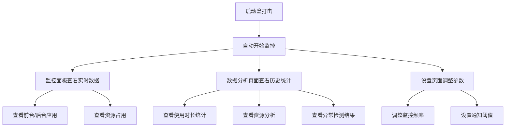

## 1. Product Overview
盒打击是一款Windows 11应用监控工具，用于实时统计和分析应用使用状况，帮助用户了解系统资源占用情况。
- 主要功能包括监控后台运行的应用、记录前台活动应用、实时分析统计结果并提供可视化数据。
- 目标用户为需要监控系统资源使用情况的Windows 11用户，特别是需要优化系统性能的用户。

## 2. Core Features

### 2.1 User Roles
| Role | Registration Method | Core Permissions |
|------|---------------------|------------------|
| 普通用户 | 无需注册 | 查看应用监控数据、分析报告、设置监控参数 |

### 2.2 Feature Module
1. **监控面板**: 实时显示运行中的应用、资源占用情况、历史数据趋势
2. **数据分析**: 应用使用时长统计、资源占用分析、异常应用检测
3. **设置页面**: 监控参数配置、数据存储设置、通知设置

### 2.3 Page Details
| Page Name | Module Name | Feature description |
|-----------|-------------|---------------------|
| 监控面板 | 实时监控 | 显示当前运行的所有应用，区分前台和后台应用，显示CPU、内存占用 |
| 监控面板 | 历史趋势 | 展示应用使用时长和资源占用的历史趋势图表 |
| 数据分析 | 使用统计 | 提供应用使用时长排名、最活跃时段分析 |
| 数据分析 | 资源分析 | 分析应用的CPU、内存、磁盘IO等资源占用情况 |
| 数据分析 | 异常检测 | 识别资源占用异常的应用并发出警报 |
| 设置页面 | 监控配置 | 配置监控频率、数据存储周期、资源占用阈值 |
| 设置页面 | 通知设置 | 配置异常应用的通知方式和阈值 |

## 3. Core Process
用户打开盒打击应用后，系统自动开始监控Windows 11上运行的所有应用。用户可以在监控面板查看实时数据，在数据分析页面查看历史统计和分析结果，并在设置页面调整监控参数。

## 4. User Interface Design
### 4.1 Design Style
- 主色调: 深蓝色 (#1E40AF) 和亮蓝色 (#3B82F6)
- 辅助色: 绿色 (#10B981) 表示正常，红色 (#EF4444) 表示异常
- 按钮样式: 圆角按钮，带有轻微的阴影效果
- 字体: 系统默认字体，标题使用16-18px，正文使用14px
- 布局风格: 卡片式布局，清晰的分区和足够的留白
- 图标风格: 使用简约的线性图标，搭配适当的颜色编码

### 4.2 Page Design Overview
| Page Name | Module Name | UI Elements |
|-----------|-------------|-------------|
| 监控面板 | 实时监控 | 卡片式布局显示应用列表，使用不同颜色区分前台/后台应用，进度条显示资源占用，实时更新数据 |
| 监控面板 | 历史趋势 | 折线图展示资源占用趋势，可选择时间范围，支持缩放和导出 |
| 数据分析 | 使用统计 | 柱状图展示应用使用时长排名，饼图展示应用类别分布 |
| 数据分析 | 资源分析 | 热力图展示资源占用情况，表格展示详细数据 |
| 数据分析 | 异常检测 | 列表展示异常应用，带有严重程度标识和详细信息按钮 |
| 设置页面 | 监控配置 | 滑块和输入框用于设置参数，开关按钮用于启用/禁用功能 |
| 设置页面 | 通知设置 | 下拉菜单选择通知方式，输入框设置阈值，预览功能 |

### 4.3 Responsiveness
- 设计采用桌面优先原则，针对Windows 11的窗口大小进行优化
- 支持窗口大小调整，布局会自动适应不同的窗口尺寸
- 关键数据始终保持可见，辅助数据在空间不足时会折叠

### 4.4 3D Scene Guidance
- 不适用，本产品为2D界面应用