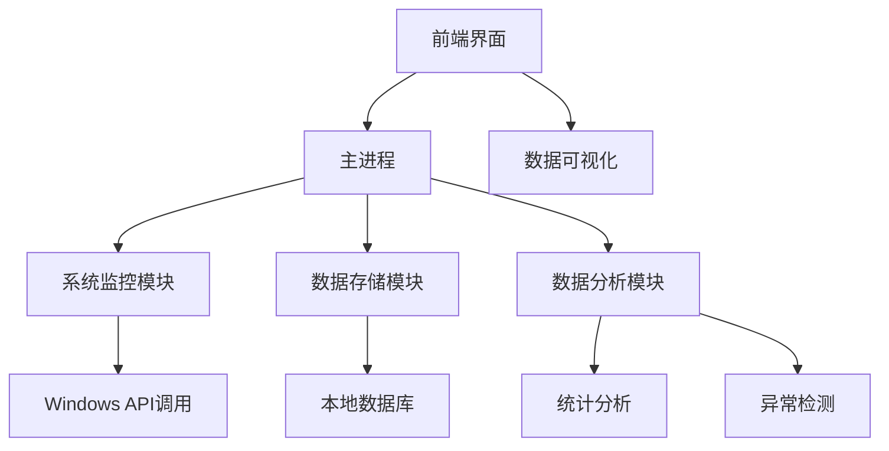
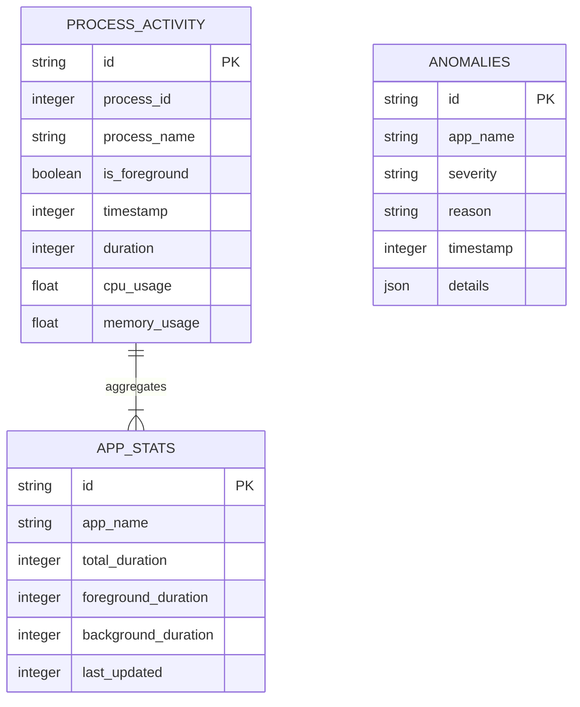

## 1. Architecture Design


## 2. Technology Description
- 前端: React@18 + tailwindcss@3 + vite
- 桌面应用框架: Electron@20
- 系统监控: node-windows-process + windows-registry
- 数据存储: SQLite3
- 数据可视化: Chart.js
- 构建工具: vite + electron-builder

## 3. Route Definitions
| Route | Purpose |
|-------|---------|
| / | 监控面板 |
| /analysis | 数据分析页面 |
| /settings | 设置页面 |

## 4. API Definitions

### 4.1 系统监控API
```typescript
// 获取当前运行的所有进程
interface ProcessInfo {
  pid: number;
  name: string;
  title: string;
  isForeground: boolean;
  cpuUsage: number;
  memoryUsage: number;
  startTime: number;
}

function getRunningProcesses(): Promise<ProcessInfo[]>;

// 获取前台活动窗口
function getForegroundWindow(): Promise<ProcessInfo | null>;
```

### 4.2 数据存储API
```typescript
// 存储进程活动数据
interface ProcessActivity {
  id: string;
  processId: number;
  processName: string;
  isForeground: boolean;
  timestamp: number;
  duration: number; // 单位：秒
  cpuUsage: number;
  memoryUsage: number;
}

function saveProcessActivity(activity: Omit<ProcessActivity, 'id'>): Promise<string>;

// 查询历史活动数据
function getProcessActivities(startTime: number, endTime: number): Promise<ProcessActivity[]>;

// 查询应用使用统计
function getAppUsageStats(startTime: number, endTime: number): Promise<{
  appName: string;
  totalDuration: number;
  foregroundDuration: number;
  backgroundDuration: number;
}[]>;
```

### 4.3 数据分析API
```typescript
// 分析资源占用情况
interface ResourceUsage {
  appName: string;
  avgCpuUsage: number;
  maxCpuUsage: number;
  avgMemoryUsage: number;
  maxMemoryUsage: number;
}

function analyzeResourceUsage(startTime: number, endTime: number): Promise<ResourceUsage[]>;

// 检测异常应用
interface Anomaly {
  appName: string;
  severity: 'low' | 'medium' | 'high';
  reason: string;
  timestamp: number;
  details: Record<string, any>;
}

function detectAnomalies(): Promise<Anomaly[]>;
```

## 5. Server Architecture Diagram
由于本项目是桌面应用，不需要传统的服务器架构，而是采用Electron的主进程和渲染进程架构。

```mermaid
graph TD
  A[渲染进程 (React UI)] --> B[IPC通信]
  B --> C[主进程 (Node.js)]
  C --> D[系统监控模块]
  C --> E[数据存储模块]
  C --> F[数据分析模块]
  D --> G[Windows API]
  E --> H[SQLite数据库]
  F --> I[统计分析算法]
```

## 6. Data Model

### 6.1 Data Model Definition


### 6.2 Data Definition Language
```sql
-- 创建进程活动表
CREATE TABLE IF NOT EXISTS process_activity (
  id TEXT PRIMARY KEY,
  process_id INTEGER,
  process_name TEXT,
  is_foreground BOOLEAN,
  timestamp INTEGER,
  duration INTEGER,
  cpu_usage REAL,
  memory_usage REAL
);

-- 创建应用统计数据表
CREATE TABLE IF NOT EXISTS app_stats (
  id TEXT PRIMARY KEY,
  app_name TEXT UNIQUE,
  total_duration INTEGER DEFAULT 0,
  foreground_duration INTEGER DEFAULT 0,
  background_duration INTEGER DEFAULT 0,
  last_updated INTEGER
);

-- 创建异常记录表
CREATE TABLE IF NOT EXISTS anomalies (
  id TEXT PRIMARY KEY,
  app_name TEXT,
  severity TEXT,
  reason TEXT,
  timestamp INTEGER,
  details TEXT
);

-- 创建索引以提高查询性能
CREATE INDEX IF NOT EXISTS idx_process_activity_timestamp ON process_activity(timestamp);
CREATE INDEX IF NOT EXISTS idx_process_activity_name ON process_activity(process_name);
CREATE INDEX IF NOT EXISTS idx_anomalies_timestamp ON anomalies(timestamp);
```